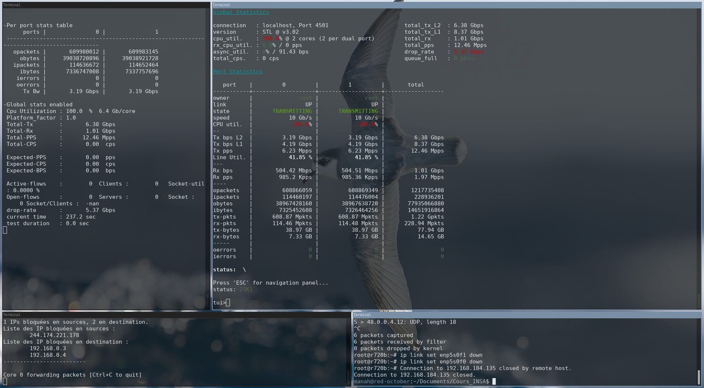

## Générateur et analyse des performances
Le rapport du projet fournis une explication plus détaillée de cette partie, il s'agit ici d'une annexe. 

Il est difficile de trouver un générateur de flux suffisament efficace pour tester DPDK. Il s'agit le plus souvent d'outil utilisant eux-même DPDK, souvent assez compliqué à configurer. Nous allons ici parcourir les différentes solutions que nous avons envisagées et/ou utilisées.

### Iperf3
Il s'agit d'un utilitaire de test grand public et fonctionne d'end-point à end-point. Sa facilité d'utilisation (ligne de commande, options simples) a fait que nous l'avons privilégié lors de notre projet. Néanmoins, il utilise la stack Linux standard, ce qui fait qu'il ne permet pas de tester un module DPDK qui serait plus efficace que cette dernière. Nous avons donc cherché dans la suite du projet d'autre utilitaire détaillées après.

### Pkg-gen / Moonpol
Basé sur libmoon, ne compile pas, documentation dépréciée. Meilleur avancement jusqu'à maintenant, build partiel en copiant les fichiers à la places des examples :
```
# cd pktgen-dpdk/
# make
>>> Use 'make help' for more commands

./tools/pktgen-build.sh build
>>  SDK Path          : /root/test/dpdk/
>>  Install Path      : /root/test/dpdk/examples/pktgen-dpdk
>>  Build Directory   : /root/test/dpdk/examples/pktgen-dpdk/Builddir
>>  Target Directory  : usr/local
>>  Build Path        : /root/test/dpdk/examples/pktgen-dpdk/Builddir
>>  Target Path       : /root/test/dpdk/examples/pktgen-dpdk/usr/local

 Build and install values:
   lua_enabled       : -Denable_lua=false
   gui_enabled       : -Denable_gui=false

>>> Ninja build in '/root/test/dpdk/examples/pktgen-dpdk/Builddir' buildtype=release
meson -Dbuildtype=release -Denable_lua=false -Denable_gui=false /root/test/dpdk/examples/pktgen-dpdk/Builddir
The Meson build system
Version: 0.56.2
Source dir: /root/test/dpdk/examples/pktgen-dpdk
Build dir: /root/test/dpdk/examples/pktgen-dpdk/Builddir
Build type: native build
Program cat found: YES (/usr/bin/cat)
Project name: pktgen
Project version: 22.04.1
C compiler for the host machine: cc (gcc 10.2.1 "cc (Debian 10.2.1-6) 10.2.1 20210110")
C linker for the host machine: cc ld.bfd 2.35.2
Host machine cpu family: x86_64
Host machine cpu: x86_64
Compiler for C supports arguments -mavx: YES 
Compiler for C supports arguments -mavx2: YES 
Compiler for C supports arguments -Wno-pedantic: YES 
Compiler for C supports arguments -Wno-format-truncation: YES 
Found pkg-config: /usr/bin/pkg-config (0.29.2)
Run-time dependency libdpdk found: YES 20.11.6
Library librte_net_bond found: YES
Program python3 found: YES (/usr/bin/python3)
Library rte_net_i40e found: YES
Library rte_net_ixgbe found: YES
Library rte_net_ice found: YES
Library rte_bus_vdev found: YES
Run-time dependency threads found: YES
Library numa found: YES
Library pcap found: YES
Library dl found: YES
Library m found: YES
Program sphinx-build found: NO
Build targets in project: 9

Found ninja-1.10.1 at /usr/bin/ninja
ninja: Entering directory `/root/test/dpdk/examples/pktgen-dpdk/Builddir'
[40/69] Compiling C object app/pktgen.p/pktgen-cfg.c.o
FAILED: app/pktgen.p/pktgen-cfg.c.o 
cc -Iapp/pktgen.p -Iapp -I../app -Ilib/common -I../lib/common -Ilib/utils -I../lib/utils -Ilib/vec -I../lib/vec -Ilib/plugin -I../lib/plugin -Ilib/cli -I../lib/cli -Ilib/lua -I../lib/lua -I/usr/include/dpdk -I/usr/include/libnl3 -I/usr/include/dpdk/../x86_64-linux-gnu/dpdk -fdiagnostics-color=always -pipe -D_FILE_OFFSET_BITS=64 -Wall -Winvalid-pch -Wextra -Wpedantic -Werror -O3 -march=native -mavx -mavx2 -DALLOW_EXPERIMENTAL_API -D_GNU_SOURCE -Wno-pedantic -Wno-format-truncation -pthread -include rte_config.h -march=corei7 '-D__PROJECT_VERSION="22.04.1"' -MD -MQ app/pktgen.p/pktgen-cfg.c.o -MF app/pktgen.p/pktgen-cfg.c.o.d -o app/pktgen.p/pktgen-cfg.c.o -c ../app/pktgen-cfg.c
In file included from ../app/pktgen.h:88,
                 from ../app/pktgen-display.h:17,
                 from ../app/pktgen-cfg.c:11:
../app/pktgen-port-cfg.h: In function ‘rte_get_rx_capa_list’:
../app/pktgen-port-cfg.h:416:22: error: ‘RTE_ETH_RX_OFFLOAD_VLAN_STRIP’ undeclared (first use in this function); did you mean ‘DEV_RX_OFFLOAD_VLAN_STRIP’?
  416 |     } rx_flags[] = {{RTE_ETH_RX_OFFLOAD_VLAN_STRIP, _(VLAN_STRIP)},
      |                      ^~~~~~~~~~~~~~~~~~~~~~~~~~~~~
      |                      DEV_RX_OFFLOAD_VLAN_STRIP

            ...
```

### TRex (Cisco)
Installation et build ok. Configuration compiquée et kernel panic dans certains cas. [Documentation bien faite et complète.](https://trex-tgn.cisco.com/trex/doc/trex_manual.html) Installation :
```bash
mkdir -p /opt/trex && cd /opt/trex
wget --no-cache --no-check-certificate https://trex-tgn.cisco.com/trex/release/latest
tar -xzvf latest && rm latest

cd v[VERSION]

# Si nécessaire :
apt install python3-distutils python3 python3-pip python3-apt

./dpdk_setup_ports.py -s # Montre les ports disponibles
./dpdk_setup_ports.py -i # Génération intéractive de fichier de conf.
```

Config. utilisée (générée automatiquement) :
```
- version: 2
  interfaces: ['0000:04:00.0', '0000:04:00.1']
  port_info:
      - ip: 1.1.1.1
        default_gw: 2.2.2.2
      - ip: 2.2.2.2
        default_gw: 1.1.1.1

  platform:
      master_thread_id: 0
      latency_thread_id: 11
      dual_if:
        - socket: 0
          threads: [1,2,3,4,5,6,7,8,9,10]
```

**Erreur au lancement :**
```
# ./t-rex-64 -f cap2/dns.yaml -c 4 -m 1 -d 10
Trying to bind to vfio-pci ...
/usr/bin/python3 dpdk_nic_bind.py --bind=vfio-pci 0000:04:00.0 0000:04:00.1 
The ports are bound/configured.
Starting  TRex v3.02 please wait  ... 
 set driver name net_ixgbe 
 driver capability  : TCP_UDP_OFFLOAD  TSO  SLRO 
 set dpdk queues mode to DROP_QUE_FILTER 
 Number of ports found: 2
zmq publisher at: tcp://*:4500
ixgbe_dev_start(): failure in ixgbe_dev_start(): -38
EAL: Error disabling MSI-X interrupts for fd 35
ixgbe_dev_start(): failure in ixgbe_dev_start(): -38
EAL: Error disabling MSI-X interrupts for fd 35
ixgbe_dev_start(): failure in ixgbe_dev_start(): -38
EAL: Error disabling MSI-X interrupts for fd 35
ixgbe_dev_start(): failure in ixgbe_dev_start(): -38
EAL: Error disabling MSI-X interrupts for fd 35
ixgbe_dev_start(): failure in ixgbe_dev_start(): -38
EAL: Error disabling MSI-X interrupts for fd 35
ixgbe_dev_start(): failure in ixgbe_dev_start(): -38
EAL: Error disabling MSI-X interrupts for fd 35
ixgbe_dev_start(): failure in ixgbe_dev_start(): -38
EAL: Error disabling MSI-X interrupts for fd 35
ixgbe_dev_start(): failure in ixgbe_dev_start(): -38
EAL: Error disabling MSI-X interrupts for fd 35
ixgbe_dev_start(): failure in ixgbe_dev_start(): -38
EAL: Error disabling MSI-X interrupts for fd 35
ixgbe_dev_start(): failure in ixgbe_dev_start(): -38
EAL: Error - exiting with code: 1
  Cause: rte_eth_dev_start: err=-5, port=0
```
Semble similaire à cette erreur, pas de solution : https://github.com/cisco-system-traffic-generator/trex-core/issues/76

--> erreur 38 c'est "fonction non implémenté"

Les cartes en question ne semble pas entièrement supportées par DPDK, j'ai de meilleur résultats avec d'autres cartes réseaux :
```
Network devices using DPDK-compatible driver
============================================
0000:04:00.0 'Ethernet 10G 2P X520 Adapter 154d' drv=igb_uio unused=
0000:04:00.1 'Ethernet 10G 2P X520 Adapter 154d' drv=igb_uio unused=
```
```
-Per port stats table 
      ports |               0 |               1 
 -----------------------------------------------------------------------------------------
   opackets |             104 |             104 
     obytes |            8008 |            9672 
   ipackets |              25 |             104 
     ibytes |            2325 |            8008 
    ierrors |               0 |               0 
    oerrors |               0 |               0 
      Tx Bw |     609.69  bps |     736.38  bps 

-Global stats enabled 
 Cpu Utilization : 0.1  %
 Platform_factor : 1.0  
 Total-Tx        :       1.35 Kbps  
 Total-Rx        :     609.69  bps  
 Total-PPS       :       1.98  pps  
 Total-CPS       :       0.99  cps  

 Expected-PPS    :       2.00  pps  
 Expected-CPS    :       1.00  cps  
 Expected-BPS    :       1.36 Kbps  

 Active-flows    :        0  Clients :      511   Socket-util : 0.0000 %    
 Open-flows      :      104  Servers :      255   Socket :        8 Socket/Clients :  0.0 
 drop-rate       :     736.38  bps   
 current time    : 108.1 sec  
 test duration   : 3491.9 sec
```

**Tentative de réinitialisation des PCI**
On a un problème : on ne peut lancer testpmd qu'une fois avant un crash, tentative de fix :
```bash
echo "1" > /sys/bus/pci/devices/0000\:04\:00.0/remove 
echo "1" > /sys/bus/pci/devices/0000\:04\:00.1/remove
echo "1" > /sys/bus/pci/rescan
devbind -s
# ça ne fonctionne pas
```

### Performance du filtre
Difficultées de fonctionnement sur les nouvelles cartes : 
```
root@r720b:~# ./filtre rules.cfg 
EAL: Detected CPU lcores: 12
EAL: Detected NUMA nodes: 1
EAL: Detected static linkage of DPDK
EAL: Multi-process socket /var/run/dpdk/rte/mp_socket
EAL: Selected IOVA mode 'VA'
EAL: VFIO support initialized
EAL: Using IOMMU type 1 (Type 1)
EAL: Ignore mapping IO port bar(2)
EAL: Probe PCI driver: net_ixgbe (8086:10f1) device: 0000:04:00.0 (socket 0)
eth_ixgbe_dev_init(): The EEPROM checksum is not valid: -2
ethdev initialisation failed
EAL: Releasing PCI mapped resource for 0000:04:00.0
EAL: Calling pci_unmap_resource for 0000:04:00.0 at 0x1180000000
EAL: Calling pci_unmap_resource for 0000:04:00.0 at 0x1180020000
EAL: Calling pci_unmap_resource for 0000:04:00.0 at 0x1180060000
EAL: Requested device 0000:04:00.0 cannot be used
EAL: Using IOMMU type 1 (Type 1)
EAL: Ignore mapping IO port bar(2)
EAL: Probe PCI driver: net_ixgbe (8086:10f1) device: 0000:04:00.1 (socket 0)
eth_ixgbe_dev_init(): The EEPROM checksum is not valid: -1
ethdev initialisation failed
EAL: Releasing PCI mapped resource for 0000:04:00.1
EAL: Calling pci_unmap_resource for 0000:04:00.1 at 0x1180064000
EAL: Calling pci_unmap_resource for 0000:04:00.1 at 0x1180084000
EAL: Calling pci_unmap_resource for 0000:04:00.1 at 0x11800c4000
EAL: Requested device 0000:04:00.1 cannot be used
TELEMETRY: No legacy callbacks, legacy socket not created
EAL: Error - exiting with code: 1
  Cause: Error: number of ports must be even
```
--> **solution** : unbind et rebind les interfaces avec `devbind.py` :
`devbind -b ixgbe 0000:04:00.0 0000:04:00.1 && ./setup.sh`

**Premier test de performance avec un générateur DPDK réussi !**
Sur dpdk-1 (filtre) :
```
# ./filtre rules.cfg 
EAL: Detected CPU lcores: 12
EAL: Detected NUMA nodes: 1
EAL: Detected static linkage of DPDK
EAL: Multi-process socket /var/run/dpdk/rte/mp_socket
EAL: Selected IOVA mode 'VA'
EAL: VFIO support initialized
EAL: Using IOMMU type 1 (Type 1)
EAL: Ignore mapping IO port bar(2)
EAL: Probe PCI driver: net_ixgbe (8086:10f1) device: 0000:04:00.0 (socket 0)
EAL: Ignore mapping IO port bar(2)
EAL: Probe PCI driver: net_ixgbe (8086:10f1) device: 0000:04:00.1 (socket 0)
TELEMETRY: No legacy callbacks, legacy socket not created
ixgbe_dev_rx_queue_start(): Could not enable Rx Queue 0
Port 0 MAC: 00 1b 21 6c e2 bb
ixgbe_dev_rx_queue_start(): Could not enable Rx Queue 0
Port 1 MAC: 00 1b 21 6c e2 ba

WARNING: Too many lcores enabled. Only 1 used.
EAL: Init. done.

Un fichier de configuration donné : rules.cfg
Règles lues depuis le fichier rules.cfg :

-------------------------
1 IPs bloquées en sources, 2 en destination.
Liste des IP bloquées en sources :
	244.174.221.178
Liste des IP bloquées en destination :
	192.168.0.3
	192.168.0.4
-------------------------

Core 0 forwarding packets [Ctrl+C to quit]
```
On utilise ici le binaire statique à cause de problèmes de dépendance de DPDK.

Sur dpdk-0 (on est en loopback):
```
-Per port stats table 
      ports |               0 |               1 
 -----------------------------------------------------------------------------------------
   opackets |            1131 |            1131 
     obytes |           87087 |          105183 
   ipackets |            1131 |            1131 
     ibytes |          105183 |           87087 
    ierrors |               0 |               0 
    oerrors |               0 |               0 
      Tx Bw |     606.52  bps |     732.55  bps 

-Global stats enabled 
 Cpu Utilization : 0.1  %
 Platform_factor : 1.0  
 Total-Tx        :       1.34 Kbps  
 Total-Rx        :       1.34 Kbps  
 Total-PPS       :       1.97  pps  
 Total-CPS       :       0.98  cps  

 Expected-PPS    :       2.00  pps  
 Expected-CPS    :       1.00  cps  
 Expected-BPS    :       1.36 Kbps  

 Active-flows    :        0  Clients :      511   Socket-util : 0.0000 %    
 Open-flows      :     1131  Servers :      255   Socket :       11 Socket/Clients :  0.0 
 drop-rate       :       0.00  bps   
 current time    : 1135.0 sec  
 test duration   : 2465.0 sec 
```

#### Utiliser t-rex plus efficacement
Situation de loopback entre un serveur de test (tester) et le filtre DPDK.

Console 1 (tester) :
```bash
cd /opt/trex/v3.02
./t-rex-64 -i -c 2
```
Console 2 (tester) :
```bash
cd /opt/trex/v3.02
./trex-console
```
Console T-Rex :
```
start -f stl/bench.py -t size=64,vm=var1
```
On doit voir un bon fonctionnement -> ok.

Lancement du filtre DPDK :
```bash
./filtre rules.cfg
```

#### Résultats
On n'a pas de paquet reçus côté T-rex, alors que le forwarding a bien lieu. Debug avec les autres interfaces :
```bash
# enp5s0f1 est sur le même VLAN que enp4s0f1
ip link set enp5s0f1 up
ip link set enp5s0f1 promisc on

tcpdump -i enp5s0f1 -ne
```
```
10:50:58.355324 a0:36:9f:0e:24:2c > 00:1b:21:6c:e2:bb, ethertype IPv4 (0x0800), length 60: 16.0.0.186.1025 > 48.0.0.4.12: UDP, length 18
10:50:58.355325 a0:36:9f:0e:24:2e > 00:1b:21:6c:e2:ba, ethertype IPv4 (0x0800), length 60: 48.0.0.186.1025 > 16.0.0.4.12: UDP, length 18
```
Les adresses MAC ne sont pas bonnes, correction du fichier de configuration :
```bash
cat /etc/trex_cfg.yaml 
```
```
### Config file generated by dpdk_setup_ports.py ###

- version: 2
  interfaces: ['04:00.0', '04:00.1']
  port_info:
      - dest_mac: a0:36:9f:0e:24:2e
        src_mac:  a0:36:9f:0e:24:2c # Loop
      - dest_mac: a0:36:9f:0e:24:2c
        src_mac:  a0:36:9f:0e:24:2e # Loop

  platform:
      master_thread_id: 0
      latency_thread_id: 3
      dual_if:
        - socket: 0
          threads: [1,2]
```

**TODO**
Test du débit avec T-Rex :
```
start -f stl/bench.py -m 10000000 -t size=64,vm=var1
```
--> **ok** 6Gbps

Exemple de sortie console 2 (tui) :
```
Global Statistics

connection   : localhost, Port 4501                       total_tx_L2  : 6.35 Gbps                      
version      : STL @ v3.02                                total_tx_L1  : 8.33 Gbps                      
cpu_util.    : 100.0% @ 2 cores (2 per dual port)         total_rx     : 1 Gbps                         
rx_cpu_util. : 0.0% / 0 pps                               total_pps    : 12.4 Mpps                      
async_util.  : 0% / 91.43 bps                             drop_rate    : 5.34 Gbps                      
total_cps.   : 0 cps                                      queue_full   : 0 pkts                         

Port Statistics

   port    |         0         |         1         |       total       
-----------+-------------------+-------------------+------------------
owner      |              root |              root |                   
link       |                UP |                UP |                   
state      |      TRANSMITTING |      TRANSMITTING |                   
speed      |           10 Gb/s |           10 Gb/s |                   
CPU util.  |            100.0% |            100.0% |                   
--         |                   |                   |                   
Tx bps L2  |         3.17 Gbps |         3.17 Gbps |         6.35 Gbps 
Tx bps L1  |         4.16 Gbps |         4.16 Gbps |         8.33 Gbps 
Tx pps     |          6.2 Mpps |          6.2 Mpps |         12.4 Mpps 
Line Util. |           41.65 % |           41.65 % |                   
---        |                   |                   |                   
Rx bps     |        502.1 Mbps |       502.17 Mbps |            1 Gbps 
Rx pps     |       980.65 Kpps |       980.81 Kpps |         1.96 Mpps 
----       |                   |                   |                   
opackets   |         967331118 |         967334492 |        1934665610 
ipackets   |         171179327 |         171204000 |         342383327 
obytes     |       61909191936 |       61909407872 |      123818599808 
ibytes     |       10955476928 |       10957056128 |       21912533056 
tx-pkts    |      967.33 Mpkts |      967.33 Mpkts |        1.93 Gpkts 
rx-pkts    |      171.18 Mpkts |       171.2 Mpkts |      342.38 Mpkts 
tx-bytes   |          61.91 GB |          61.91 GB |         123.82 GB 
rx-bytes   |          10.96 GB |          10.96 GB |          21.91 GB 
-----      |                   |                   |                   
oerrors    |                 0 |                 0 |                 0 
ierrors    |                 0 |                 0 |                 0 

status:  /
```
Sortie console 1 :
```
-Per port stats table 
      ports |               0 |               1 
 -----------------------------------------------------------------------------------------
   opackets |      1647524510 |      1647527594 
     obytes |    105441568640 |    105441766336 
   ipackets |       278888031 |       278929456 
     ibytes |     17848833984 |     17851485440 
    ierrors |               0 |               0 
    oerrors |               0 |               0 
      Tx Bw |       3.18 Gbps |       3.18 Gbps 

-Global stats enabled 
 Cpu Utilization : 100.0  %  6.4 Gb/core 
 Platform_factor : 1.0  
 Total-Tx        :       6.36 Gbps  
 Total-Rx        :       1.01 Gbps  
 Total-PPS       :      12.42 Mpps  
 Total-CPS       :       0.00  cps  

 Expected-PPS    :       0.00  pps  
 Expected-CPS    :       0.00  cps  
 Expected-BPS    :       0.00  bps  

 Active-flows    :        0  Clients :        0   Socket-util : 0.0000 %    
 Open-flows      :        0  Servers :        0   Socket :        0 Socket/Clients :  -nan 
 drop-rate       :       5.35 Gbps   
 current time    : 404.0 sec  
 test duration   : 0.0 sec 
```
On a des problèmes de performances dues à la saturation des CPU.

Exemple de sortie :

<br />
  <p align="center">
    
  </p>
<br />

#### Amélioration
MTU : 1500
donc :
`start -f stl/bench.py -m 2 -t size=1518,vm=var1`


#### Erreur courante
Du côté du filtre, le bind des drivers est très aléatoire et un reset est souvent nécessaire entre deux run :
```
EAL: Detected CPU lcores: 12
EAL: Detected NUMA nodes: 1
EAL: Detected static linkage of DPDK
EAL: Multi-process socket /var/run/dpdk/rte/mp_socket
EAL: Selected IOVA mode 'VA'
EAL: 1 hugepages of size 2097152 reserved, but no mounted hugetlbfs found for that size
EAL: VFIO support initialized
EAL: Using IOMMU type 1 (Type 1)
EAL: Ignore mapping IO port bar(2)
EAL: Probe PCI driver: net_ixgbe (8086:10f1) device: 0000:04:00.0 (socket 0)
eth_ixgbe_dev_init(): The EEPROM checksum is not valid: -1
ethdev initialisation failed
EAL: Releasing PCI mapped resource for 0000:04:00.0
EAL: Calling pci_unmap_resource for 0000:04:00.0 at 0x1180000000
EAL: Calling pci_unmap_resource for 0000:04:00.0 at 0x1180020000
EAL: Calling pci_unmap_resource for 0000:04:00.0 at 0x1180060000
EAL: Requested device 0000:04:00.0 cannot be used
EAL: Using IOMMU type 1 (Type 1)
EAL: Ignore mapping IO port bar(2)
EAL: Probe PCI driver: net_ixgbe (8086:10f1) device: 0000:04:00.1 (socket 0)
eth_ixgbe_dev_init(): The EEPROM checksum is not valid: -1
ethdev initialisation failed
EAL: Releasing PCI mapped resource for 0000:04:00.1
EAL: Calling pci_unmap_resource for 0000:04:00.1 at 0x1180064000
EAL: Calling pci_unmap_resource for 0000:04:00.1 at 0x1180084000
EAL: Calling pci_unmap_resource for 0000:04:00.1 at 0x11800c4000
EAL: Requested device 0000:04:00.1 cannot be used
TELEMETRY: No legacy callbacks, legacy socket not created
EAL: Error - exiting with code: 1
  Cause: Error: number of ports must be even
```
