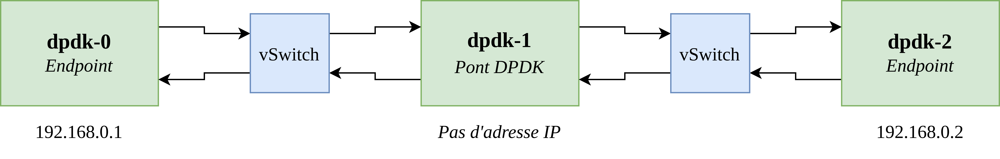

## DPDK dans une infrastructure virtuelle
Nous avons essayé de réaliser plusieurs bancs d'essais virtuels sous différents hyperviseurs. Le seul où nous avons obtenus des résultats significatifs est Proxmox. La structure utilisée pour le banc d'essais est la suivante :



### VMWare
Bien que le déploiement des VM et la mise en place des vSwitch a été facile, la configuration de DPDK des interfaces `vmxnet3` de VMWare n'a pas permit d'utiliser DPDK
```
meson -Dexamples=all build
ninja -C build

tcpdump -i ens224 -vv -en

make
./l2fwd -c 1 -n 4 -- -p 2
./l2fwd -c 1 -n 4 -- -q 8 -p f --portmap="(0,1)"

dpdk-testpmd -c7 -n 4 -- -i --nb-cores=2 --nb-ports=2 --total-num-mbufs=2048
```
Commande SSH groupé pour setup VMware:
```bash
for i in $(seq 0 2); do gnome-terminal -- ssh adminlocal@192.168.200.2$i; done
```
